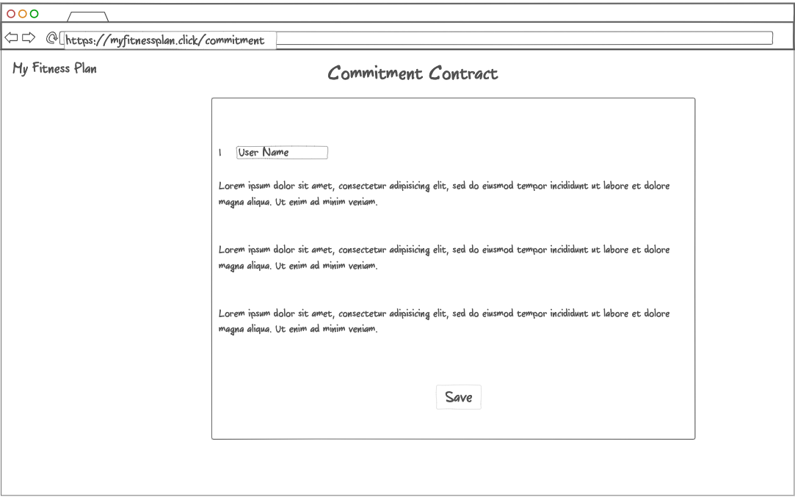
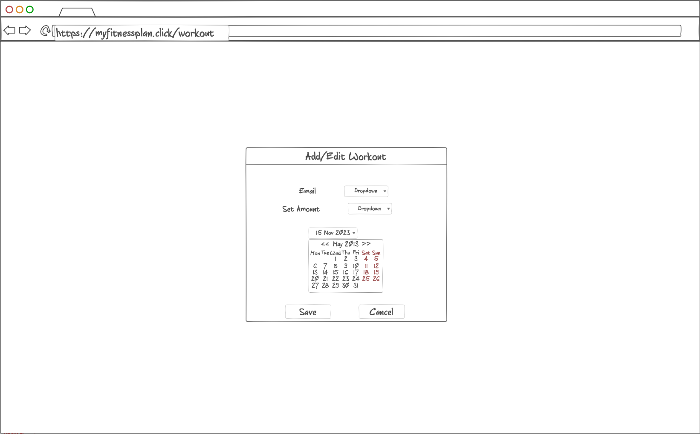
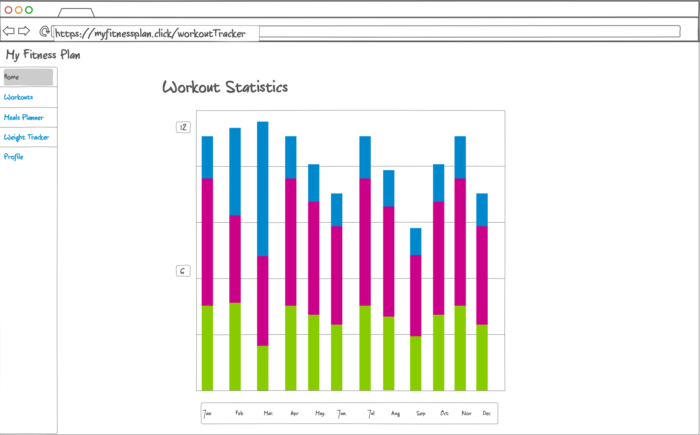
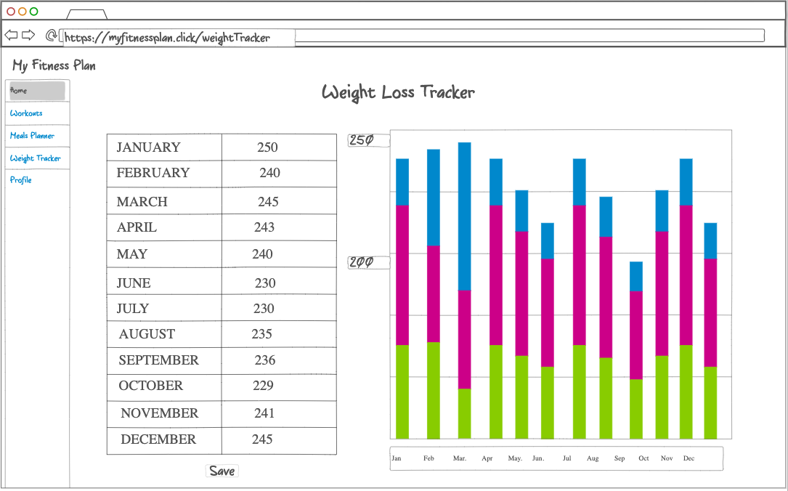
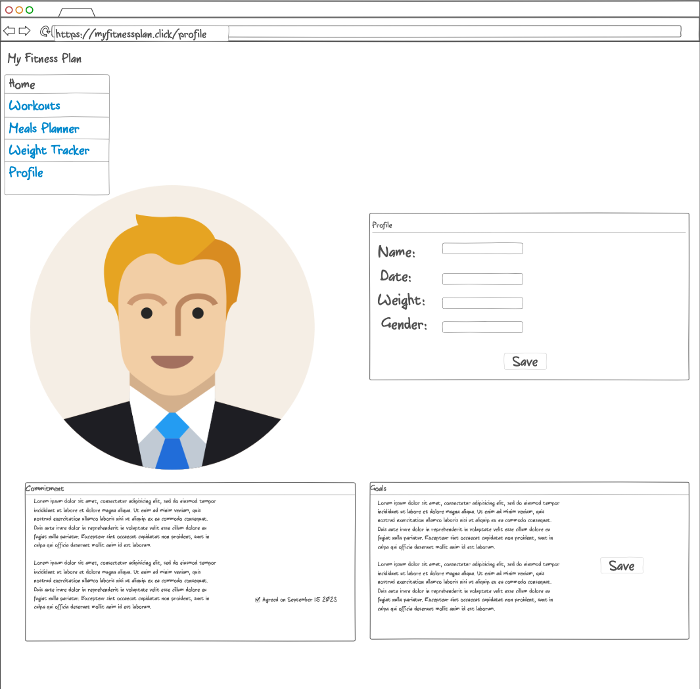
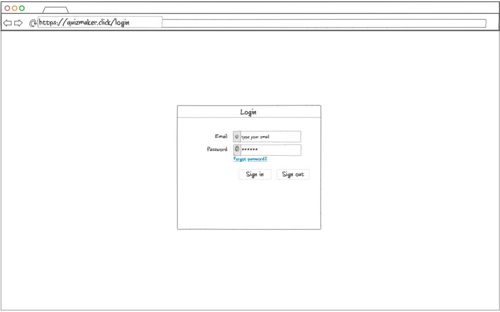
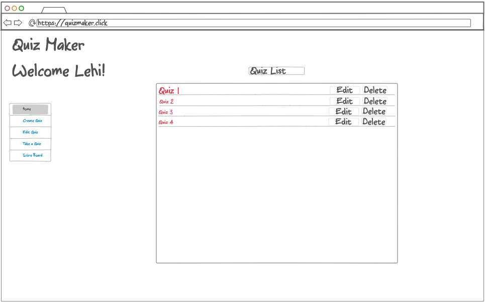
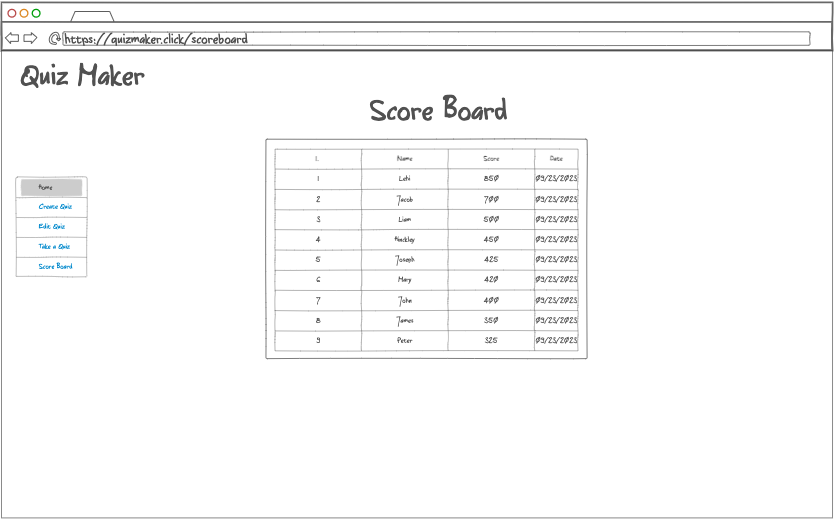
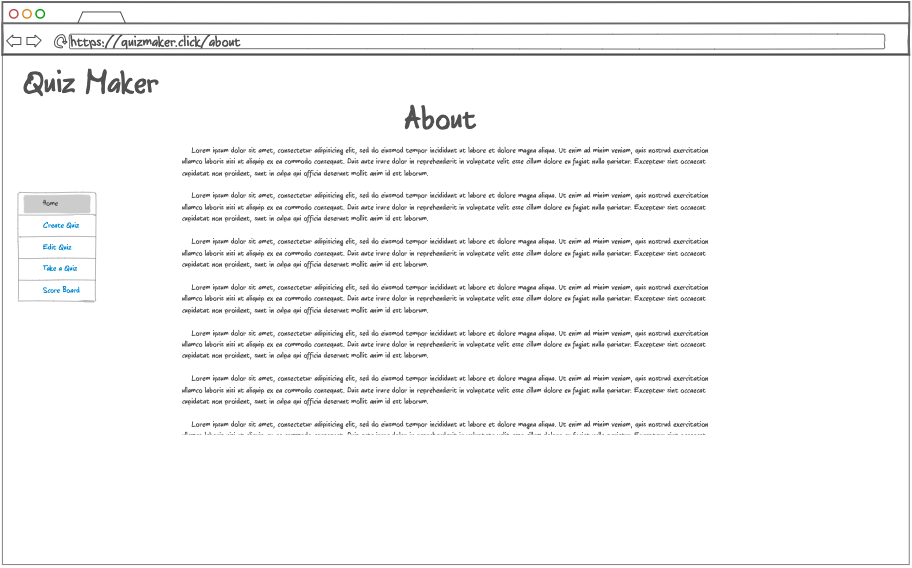

# There are 2 Project proposition here (MyFitnessPlan & QuizMaker) Please give feedback whether both of them can work and I will make the decision before the next assignments and update the Readme to only contain one project. Thank you!

# My Fitness Plan
## Description Deliverable

### Elevator Pitch

My fitness plan app is a fitness tracking app that allows users to plan & log their workouts with an easy user experience by allowing users to plan workouts in advance. Add or edit workouts and keep track of them by enabling them to look at a workout chart. Allow users to input weight each month and display a graph to easy see where they are at monthly. 

Have you ever been at a grocery store and by default just buying what you have always bought, potentially/usually junk food? This app will enable users to create healthy meals list, so that when you go to the grocery store you will have a good idea what items you should get. 

A key fitness strategy is to keep users motivated, this app will display motivational quotes to keep them motivated and stick with their fitness goals.

In summary the main goal is to enable users to plan and track workout efforts, create healthy recipes meals list as to influence purchase of healthy food and live a healthy lifestyle!
### Designs

#### Login
<!--  -->

#### Commitment
<!--  -->

#### Dashboard
<!--  -->

#### Add/Edit Workout
<!--  -->

#### Workout Tracker
<!--  -->

#### Weight Tracker
<!--  -->

#### Profile
<!--  -->

### Key Features

* Secure login over HTTPS
* Commitment contract agreement, to keep user accountable
* Ability to select workout date
* Ability to select and change, workout choices and sets
* Workout & goals are persistently stored
* Ability for users to create, delete, report workouts and fitness goals
* Ability to track workouts, weight loss
* Ability to create lists of healthy meals for easy grocery shopping list.
* Suggested motivational quotes
* Profile page about the user

### Technologies

I will be using the below technologies in the following ways:

* HTML: A few web pages to display user data, navigation links from one page to another
* CSS: Style web pages and make it more user friendly, good spacing between elements, readability, and mobile friendly.
* Javascript: logic to enable user to perform actions on each web page. 
* Service: Backend API rest service:
  * login
  * add/edit workout
  * add/edit goals
  * add/edit healthy meals
  * progress reports for workouts and weight loss
  * add/edit weight goals
  * add/edit profile data
* DB: store user input in long term storage
* Login: Register & login users. Secure secrets in database / use 3rd party tools. User can only interact with website after successful login.
* WebSocket: Each user will receive motivatioanl quotes coming from server w/out asking for it
* React: Application will be then ported to React framework.

---------------------------------------------------------------------------------------------------------

# Quiz Maker
## Description Deliverable

### Elevator Pitch

Have you ever been stressed out for a test and there is too much to learn for the test? Start small quizzing yourself on the subject matter one question at a time, once you create a quiz deck and get all the questions right, you will feel relieved that you got the correct knowledge to ace that test.

Quiz Maker is a fun application that lets you build an online quiz platform where users can create quizzes, take quizzes, and view their scores. Each user will have their own account behind authentication. All the quizzes and answers will be stored in a database, so go ahead and start today creating and taking quizzes, the result of each quiz will  update your scores real-time.

### Designs

#### Login
<!--  -->

#### Dashboard
<!--  -->

#### Dashboard
<!--  -->

#### Dashboard
<!--  -->

#### Scoreboard
<!--  -->

#### Add/Edit Workout
<!--  -->

### Key Features

* Secure login over HTTPS
* Ability to create quizzes
* Ability to edit quizzes
* Ability to take any quizzes created in the system
* Ability as a creator of a quiz to give points to a given question
* Quizzes are persistently stored
* A scoreboard will list all scores real-time

### Technologies

I will be using the below technologies in the following ways:

* HTML: A few web pages to display & create quizzes, navigation links from one page to another
* CSS: Style web pages and make it more user friendly, good spacing between elements, readability, and mobile friendly.
* Javascript: logic to enable user to perform actions on each web page. 
* Service: Backend API rest service:
  * login
  * get/add/edit/delete quizzes
  * get/add/edit/delete questions points if creator of the quiz
  * submit quiz score
  * get scoreboard data
  * get dashboard data
  * get about data
* DB: store user scores in long term storage
* Login: Register & login users. Secure secrets in database / use 3rd party tools. User can only interact with website after successful login.
* WebSocket: User's activities and scores will be updated real-time coming from server w/out client asking for it
* React: Application will be then ported to React framework.

[Notes link](notes.md)

